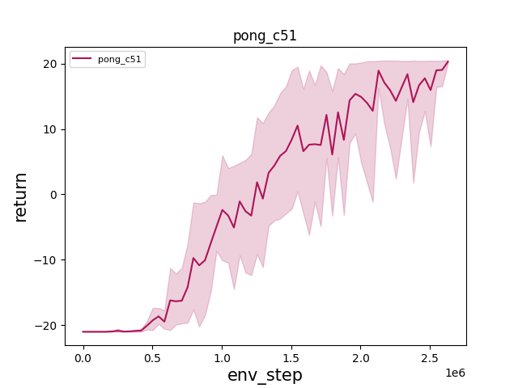
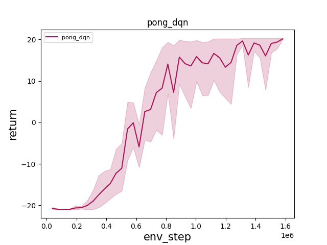
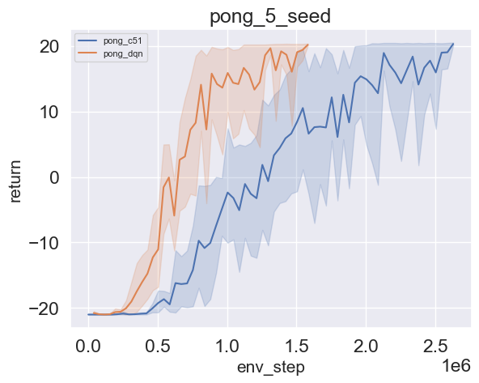

# AutoLinePlotter
This repo support auto line plot for multi-seed event files from TensorBoard

To use this AutoLinePlotter, simply ``pip install AutoLinePlotter``. Then, import ``plotter`` function from  ``AutoLinePlotter`` to make a lineplot/lineplots.

For the function ``plotter``, it has the following inputs:

>``root: str,``: the location of the folder containing all algorithms data. Each is a folder containing a few seeds of event file generated from TensorBoard.

>``titles: List[str]``: the titles to be plotted in each diagram; This has no effect in plot_together mode

>``labels: List[str]``: the labels for each algorithm

>``x_axes: List[str]``: the x-axis for each diagram; This has no effect in plot_together mode

>``y_axes: List[str]``: the y-axis for each diagram; This has no effect in plot_together mode

>``plot_together: bool = False``: whether to plot together or not

>``plot_together_x_axis: str = None``: if plot_together, indicates the x axis for the plot

>``plot_together_y_axis: str = None``: if plot_together, indicates the y axis for the plot

>``plot_together_title: str = None``: if plot_together, indicates the title for the plot

***

For example, under ``User/files/pong`` directory (see below), we have two folders: ``pong_c51`` and ``pong_dqn`` in which a few events files are included respectively.
In this case, ``root`` should be ``'User/files/pong'``; ``titles`` could be ``['pong_c51', 'pong_dqn']``;  labels could be ``['pong_c51', 'pong_dqn']``;
``x_axes`` could be ``['env_step','env_step'] ``, ``y_axes`` could be ``['return','return']``.

>- User/files/pong
>
>   - pong_c51
>      - events.out.tfevents.1632662517.pong-c51-seed0
>      - events.out.tfevents.1632662517.pong-c51-seed1
>      - events.out.tfevents.1632662517.pong-c51-seed2
>      - events.out.tfevents.1632662517.pong-c51-seed3
>      - events.out.tfevents.1632662517.pong-c51-seed4
>   - pong_dqn
>      - events.out.tfevents.1632662517.pong-dqn-seed0
>      - events.out.tfevents.1632662517.pong-dqn-seed1
>      - events.out.tfevents.1632662517.pong-dqn-seed2
>      - events.out.tfevents.1632662517.pong-dqn-seed3
>      - events.out.tfevents.1632662517.pong-dqn-seed4

> Funcion output 

> 
> 

**Notice**

 ``titles``, ``labels``, ``x_axes``, ``y_axes`` should follow the alphabetical order for the files within root. This is, in the case above, all these
four list will be of dimension two. For whatever one enters, the first element in all these four lists should point to the final graph of ``pong_c51`` and the 
second element in all these four lists should point to the final graph of ``pong_dqn``.

The only restriction in naming folders is for the folders containing events files. The format should be ``env_algo``. For instance, in the above case, the two folders are named
``pong_c51`` and ``pong_dqn`` respectively. (there should not be any ``_`` within ``env`` or ``algo`` naming)

If ``plot_together`` is enabled, these line plots will be plotted together. So, besides the above input, users should turn on ``plot_together `` and set 
``plot_together_x_axis ``, ``plot_together_y_axis`` and ``plot_together_title``. Notice that in this case, ``titles``, ``x_axes``, ``y_axes`` will have no effects. However,
They should be implemented as if the user wants to plot with ``plot_together=False`` to avoid errors. If ``plot_together`` is enabled, the output for the above example is as follows:

> Funcion output 

> 